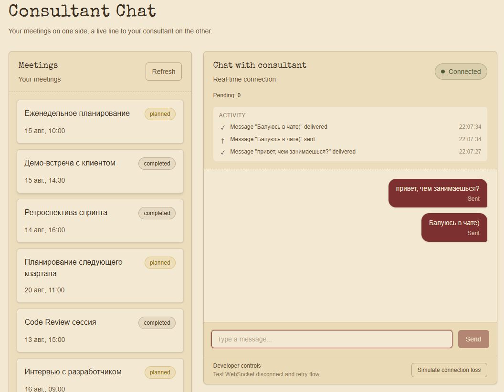
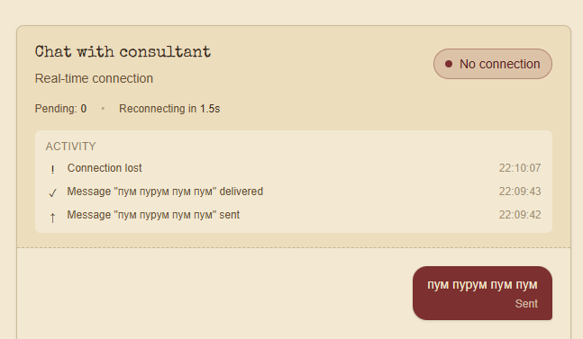
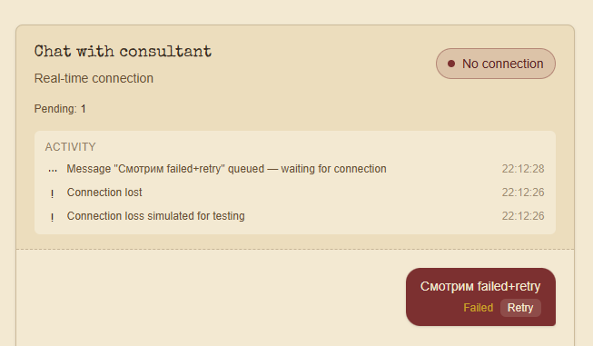
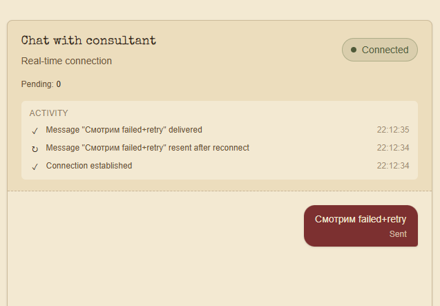

# Consultant Chat

Мини-реализация страницы «Чат с консультантом» на Next.js с серверным списком встреч и real-time чатом через WebSocket.

Задача была интересной тем, что здесь нужно было одновременно сохранить server-side rendering, использовать TanStack Query для дальнейшей работы с данными на клиенте и аккуратно организовать lifecycle WebSocket-соединения.



## Stack

- Next.js (App Router)
- TypeScript
- TanStack Query
- Tailwind CSS
- WebSocket (`ws`)
- React Hooks

## Run locally

Установить зависимости:

```bash
npm install
```

Запустить Next.js:

```bash
npm run dev
```

В отдельном терминале запустить WebSocket server:

```bash
node server.js
```

После этого открыть [http://localhost:3000/chat](http://localhost:3000/chat) (корень `/` редиректит туда же).

`.env.local` уже лежит в репозитории — там `APP_URL=http://localhost:3000`, он нужен серверу для собственного fetch к `/api/meetings`. Страница `/chat` помечена `export const dynamic = "force-dynamic"`, поэтому рендерится на каждый запрос, а не один раз при сборке — иначе при отсутствии `APP_URL` в момент билда (например, в CI) ошибка получения встреч намертво запеклась бы в статический HTML.

## Architecture

### Meetings

Список встреч доступен через `GET /api/meetings` — Route Handler, отдающий mock-данные.

Первоначальный список рендерится на сервере, поэтому он остаётся доступен даже при отключённом JavaScript. После загрузки клиентская часть работает через TanStack Query: кнопка `Refresh` выполняет повторный запрос данных без перезагрузки страницы.

### Server / Client boundary

Граница между Server и Client Components выбрана намеренно.

Server Component отвечает за страницу `/chat` и первоначальный рендер списка встреч (через `prefetchQuery` + `HydrationBoundary`). Это позволяет сохранить SSR и выполнить требование о доступности списка без JavaScript.

Client Components используются там, где реально нужна интерактивность или браузерные API:

- TanStack Query и кнопка `Refresh`;
- ввод и отправка сообщений;
- WebSocket, состояние подключения, reconnect;
- очередь сообщений и `Retry`.

WebSocket-логика вынесена в отдельный хук `useChat` (`features/chat/hooks/useChat.tsx`). Компонент `Chat` отвечает преимущественно за UI, а lifecycle соединения, reconnect и очередь сообщений изолированы внутри хука.

## WebSocket

Чат работает поверх WebSocket. При отправке сообщение сразу появляется в UI со статусом `pending`. После получения echo от сервера (сервер возвращает тот же `id`) оно переводится в `sent`.

При потере соединения выполняется автоматическое переподключение без перезагрузки страницы:

```text
Connected
    ↓
Connection lost
    ↓
Reconnect
    ↓
Connected
```



Для сообщений используется pending queue. Если сообщение не удалось отправить во время отсутствия соединения, оно не теряется:

```ts
// sendMessage
pendingQueueRef.current.push(wsMessage);
updateMessageStatus(message.id, "failed");
```

После восстановления соединения очередь автоматически отправляется повторно:

```ts
// flushPendingQueue, вызывается из socket.onopen
for (const message of pendingQueueRef.current) {
  updateMessageStatus(message.id, "pending");
  socket.send(JSON.stringify(message));
}
```

Также реализован ручной `Retry` для сообщений со статусом `failed` — он делает то же самое, что и авто-resend, просто по клику. Для reconnect используется единый таймер (`reconnectTimeoutRef`), поэтому несколько параллельных попыток переподключения не создаются.

### Проверка WebSocket-сценариев

В интерфейс добавлен небольшой **Developer control** — `Simulate connection loss`.

Он нужен исключительно для удобства проверки. Тестовый сервер сам разрывает соединение раз в 25–35 секунд:

```js
// server.js
setTimeout(() => {
  ws.terminate();
}, 25000 + Math.random() * 10000);
```

Ждать случайный disconnect неудобно, особенно при проверке сценария `failed → Retry`. Кнопка воспроизводит потерю соединения в любой момент:

```text
Connected
    ↓
Simulate connection loss
    ↓
No connection
    ↓
Send message
    ↓
Failed / Retry
    ↓
Reconnect
    ↓
Resend
    ↓
Delivered
```

Важный нюанс: обычный серверный disconnect (тот самый `ws.terminate()` раз в 25–35 секунд) почти никогда не покажет `failed`. Если сообщение к этому моменту уже ушло, `onclose` не трогает его статус — оно остаётся в `pendingQueueRef` и на `onopen` уходит заново:

```text
Connected → Send → pending → server disconnect → reconnect → resent → delivered
```

`failed` появляется только тогда, когда `sendMessage` вызывается, пока сокета вообще нет. При обычном disconnect это тоже возможно, но окно слишком короткое и непредсказуемое: echo-сервер отвечает через 300 мс, так что даже `pending` обычно не успеваешь заметить глазами. Надёжно воспроизвести именно `failed → Retry` можно только через `Simulate connection loss` — он держит соединение разорванным, пока вы сами не отправите сообщение.



Под капотом кнопка закрывает текущий сокет и временно блокирует авто-reconnect, чтобы было время проверить состояние «нет связи»:

```ts
// simulateDisconnect
socket.close();
shouldReconnectRef.current = false;

simulationTimeoutRef.current = setTimeout(() => {
  shouldReconnectRef.current = true;
  connect();
}, SIMULATED_DISCONNECT_DURATION);
```

Отдельной mock-логики для чата здесь нет — кнопка использует тот же `connect()`/reconnect/очередь, что и настоящий обрыв связи, поэтому сценарий получается достоверным, а не нарисованным для вида. Иначе говоря, `Simulate connection loss` добавлен для удобства проверки сценариев, которые иначе трудно воспроизвести вручную из-за короткого времени ответа echo-сервера.

После восстановления соединения то же самое сообщение уходит из очереди само, без участия пользователя:



## Production considerations

Для тестового задания используется простой echo-протокол из условия. В production я бы дополнительно завёл серверный ACK и idempotency для сообщений — у каждого сообщения уже есть уникальный `id` (генерируется на клиенте через `crypto.randomUUID()`), его можно использовать как основу для защиты от дублей при повторной отправке после разрыва.

Из того, что не стал делать в рамках тестового:

- деплой — WebSocket-серверу нужен свой процесс/хостинг, Vercel serverless для долгоживущего соединения не подходит, это отдельная инфраструктурная история;
- сохранение неотправленных сообщений в `localStorage` — сейчас `pending`/`failed` сообщение теряется при перезагрузке вкладки;
- тесты на `useChat` (reconnect, retry, гонки между `onclose` и повторной отправкой).

## CI

GitHub Actions запускает проверки на каждый push и pull request:

```bash
npm ci
npm run lint
npm run typecheck
npm run build
```

Это ловит поломки типов, линта и сборки до мержа.

## Time spent

~6–7 часов на реализацию. Отдельно часов 5 ушло на то, чтобы освежить работу с WebSocket (плотно с ними не работал около 4 лет) и вдумчиво разобраться с SSR/гидратацией. Итого около 12 часов, но это не 12 часов непрерывного кодинга.
